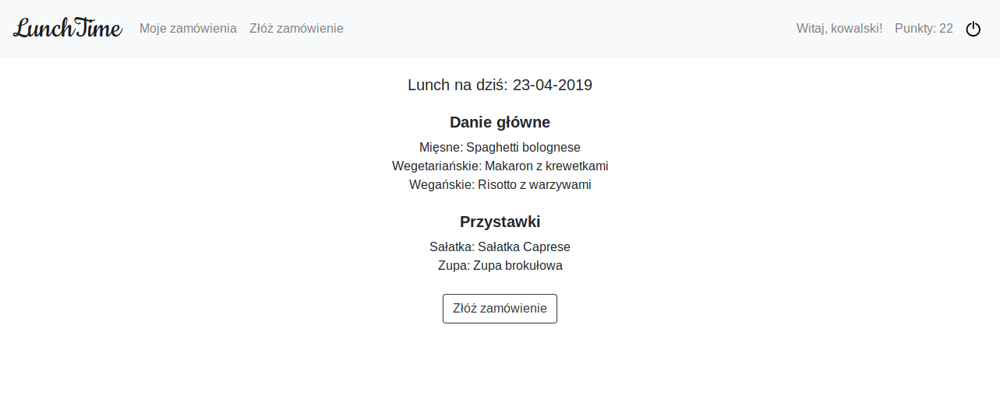

# LunchTime

### Info
App created for lunch ordering. The user can compose lunch from one of three main dishes (meat, vegetarian or vegan), one of two appetizers (soup or salad) and a beverage.

 
 
 
 
 

### Technologies
* Python 3.6 
* Django 2.1 
* PostgreSQL
* jQuery
* Bootstrap 4

### Functions
Admin can:
* add main dishes, appetizers and beverages
* view main dishes, appetizers and beverages
* set lunch for a particular date
* view lunches in calendar
* edit lunch
* view today's orders
* confirm when the lunch is ready
* view order history
* view lunch ranking
* view user details
* randomly set lunches for the next three months

User can:
* order lunch
* collect bonus points
* exchange points for discounts
* view order history
* review lunch

### Installation
* create Postgres database 'buy_lunch'
* clone and download repository
* install requirements
* run migrations for 'buy_lunch' app

